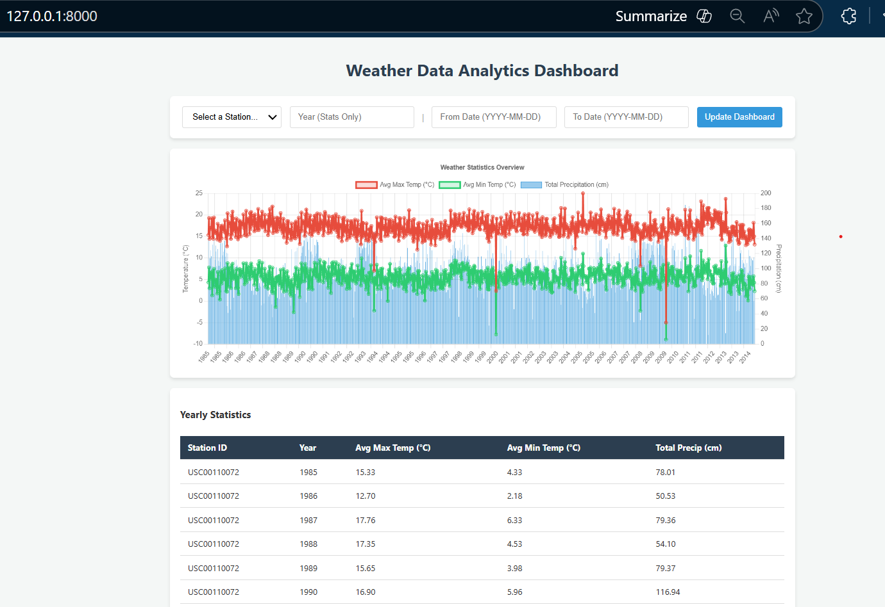

## Project Overview

This project demonstrates data ingestion, modeling, analysis, and API exposure using Python, FastAPI, and SQLAlchemy.

## 📊 Dashboard Preview

Below is a snapshot of the interactive web dashboard. It allows for dynamic filtering by station, year, and date range, and visualizes the data through a combination chart.



---

## 🚀 Quick Start

Follow these simple instructions to set up and run the project locally.

### Prerequisites
*   Python 3.8+
*   Ensure the `artifacts/wx_data` folder (containing the weather text files) is present in the project root directory.

### 1. Setup Environment
```bash
# Install dependencies
pip install -r requirements.txt
```

### 2. Ingest Data (Problem 2)
This script handles data parsing, unit conversion, and duplicate checking. from artifacts/wx_data

```bash
python -m app.ingest
```
*   **Action**: Reads files from `artifacts/wx_data`, processes them, and inserts them into the database.
*   **Output**: Console logs indicating start time, number of records processed, and total execution time.
*   **Result**: Creates `weather.db` (SQLite) and populates the `weather_record` table.

### 3. Run Analysis (Problem 3)
Calculate yearly statistics (average max/min temperature, total precipitation) for each weather station.

```bash
python -m app.services.analysis
```
*   **Action**: Aggregates data from `weather_record` and calculates stats.
*   **Result**: Populates the `weather_stats` table with the calculated results.

### 4. Launch REST API (Problem 4)
Start the FastAPI server to expose the data via a REST interface.

```bash
uvicorn app.main:app --reload
```
*   **Web Dashboard**: [http://localhost:8000](http://localhost:8000) (Interactive Data Visualization)
*   **Swagger Documentation**: [http://localhost:8000/docs](http://localhost:8000/docs) (Interactive API testing)


**Available Endpoints:**
*   `GET /api/weather`: Retrieve raw weather records (supports pagination & filtering).
*   `GET /api/weather/stats`: Retrieve calculated yearly statistics.

### 5. Run Tests
Execute the test suite to verify API functionality and data integrity.

```bash
pytest
```

---

## ☁️ Deployment Strategy

This section outlines the proposed architecture for deploying this application to AWS, prioritizing scalability, automation, and continuous data updates.

### Core Architecture
We utilize a **Serverless Architecture** to minimize operational overhead and costs.

*   **API Hosting**: **AWS Lambda** (running the FastAPI app) fronted by **Amazon API Gateway**. This allows the API to scale automatically with request volume.
*   **Database**: **Amazon RDS for PostgreSQL**. A managed relational database service replacing the local SQLite file for production reliability and concurrency.
*   **Secrets Management**: **AWS Secrets Manager** to securely store database credentials.

### Continuous Weather Data Updation
To ensure the database is continuously updated as new weather data becomes available, we utilize an event-driven pipeline:

1.  **Data Arrival**: New weather data files are uploaded to a designated **Amazon S3** bucket.
2.  **Trigger**: An **S3 Event Notification** automatically triggers an **Ingestion Lambda** function.
3.  **Processing**: The Ingestion Lambda runs the `ingest.py` logic, parsing the new file and performing an "upsert" (update or insert) operation into the RDS database.
4.  **Analysis Update**: Upon successful ingestion, an **AWS EventBridge** rule triggers the **Analysis Lambda** (`analysis.py`). This recalculates and updates the statistics table ensuring the API always serves the freshest insights.

This pipeline ensures that the system is **self-updating** and requires no manual intervention to stay current.

---

## 🔮 Future Roadmap

While the current implementation fulfills the core requirements, the following enhancements are planned for future iterations:

*   **User Management UI**: Development of a frontend dashboard (using React or Vue.js) allowing users to register, log in, and manage their preferences (e.g., favorite weather stations).
*   **Enhanced Security**: Implementation of OAuth2/JWT authentication to secure API endpoints.